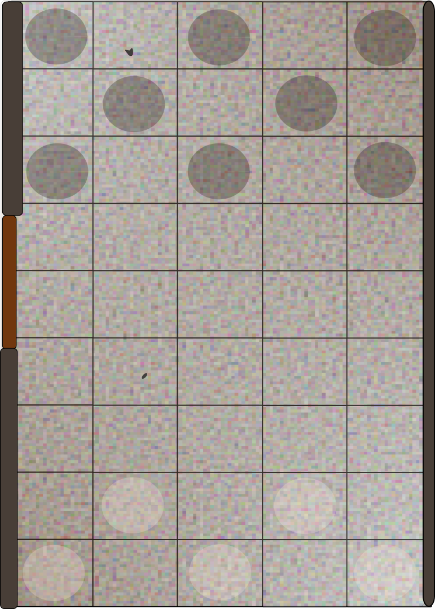

# Fires In the Crypt - Solo Play Options

_by Eduardo del Corral, bajainnotech@proton.me_

This document is a quick supplement for _Sanglorian_'s excellent first level adventure for his 4th Edition Retroclone **Orcus RPG**. All this does is try to provide some solo play options for the start where it's a bit more open ended. I hope you enjoy it.

## What you will need

* [The Orcus rules](https://sanglorian.github.io/orcus/Basic.html)
* [Fires in the Crypt adventure PDF](https://github.com/Sanglorian/orcus/blob/main/Fires%20in%20the%20Crypt.pdf) (the PDf has consistent formatting)
* This supplement
* And of course: Dice, a pencil and some sheets of paper

## Create your party

Create a party (preferably of 4), [I recommend choosing from Sanglorian's premade characters](https://sanglorian.github.io/orcus/Example%20Orcus%20Characters.html)

## Playing the quest

Read the first page of the PDF as is.

### Monster Attacks

Here's a handy reference depending on the number of characters in your party:

1. The only player is always attacked.
2. You can either toss a coin, or roll a d4 and divide the outcome by 2 and round up the number.
3. Roll a d6 and divide the outcome by 2 then round up the outcome.
4. Roll a d4.
5. Roll a d10 and divide by 2 then round up the outcome.
6. Roll a d6.
7. Roll a d10, if you roll an 8 the character who's turn it is gets attacked, if you roll a 9 then the character who's turn is next is attacked...

You can use the example of 7 to extrapolate for larger parties (though you should preferably have a party of 4 which is straightforward).

## 1A - Rumors

You need to explore the town and obtain 3 clues to complete this section. To get a clue, a player must travel to a location of interest and succeed in the corresponding DC with THEIR stats (even when playing solo you could just send one of the party members at a time). Once the clue has been obtained, landing back to this area triggers an event.

Now throw a d6 and see which area you will be visiting:

### Areas Table

1. Leaky Mug Tavern
2. Widow Bessie's
3. Alley behind the tavern
4. Imperial Barracks
5. Gallows
6. Event...

If you land on event or a revisited area, roll the events table

### Events Table

1. You meet a random NPC
2. Rest at the Inn, 3 GP each (whomever is unable to pay will lose their turn working off their debt)
3. Nothing happens
4. You're assaulted by thieves, you fight a Gang of Ruffians ([see the monsters compendium](https://sanglorian.github.io/orcus/Orcus%20Monsters%20-%20current.html)). You face 3 Moon Strikers mooks, and roll a d4 to see who's their leader:

#### Ruffians Table

1. Bodyguard
2. ChainBrawler
3. Mancatcher
4. 3 more Moon Strikers

_Naturally, being ruffians they try to attack from the back in a narrow street but they are not astute enough to catch you unaware. Place enemies in the dark circles and your party members in the clear circles_

If you meet a random NPC, roll the random NPC table. Unlike locations, random NPCs can be repeated any number of times.

### Random NPC Table

1. You're offered to partake on a game of chance, for the cost 5 GP you can earn up to 50 GP - but you must get a better roll with your D4 and d6 than the house which uses a d20. You can play up to 3 times (you pay 5 GP each time) but play stops if you win.
2. A citizen asks for help fixing her roof. The pay is 15 Gold, if you accept roll a 10DC Dex, or suffer 1d6. Either way you get the money.
3. A wolf has been scaring away a farmer's sheep defeat it and you get a long rest and 10 GP The entire party vs [1 wolf + 1 Dog](https://sanglorian.github.io/orcus/Orcus%20Monsters%20-%20current.html)
4. An old woman asks you for money in exchange for gear from her late husband. Pay 10 GP, then throw a d20, on an 1-5 you get a broken dagger that's worthless, on a 6-10 you get a duneoneers pack, on a roll of 11 - 17 you get 50 GP of adventuring gear, on a roll of 18-19 you get your choice of standard weapon or armor, on a nat 20 - you get your choice of a +1 weapon (she just happens to be carrying that one you needed).

_Once you've left the town, consider the Inn described before. As long as the adventure allows for it, you can come here and recover._

## The Arena

You must establish rapor with the guards and even partake in their pastime, but for that you must earn their trust. Roll a DC 12 diplomacy check to see if you can have a good understanding:

_If you succeed:_ You learn about the challenges and are extended a chance to participate. You accept, and soon you're in the pit.
_If you fail:_ Soldiers ignore you until the match is over, then suddenly you are thrown in the pit and you land face first. You are prone, adversaries gain the first attack.

### Adversaries in the arena

* Sticky tongued toad - 39 HP
* Apefolk legionnaire - 29 HP
* Apefolk infantry - 1 HP (defeating a mook will be equivalent to knocking him out)

Mooks are considered incapacitated upon defeat, all other soldiers must be reduced to 0HP. Soldiers will die if their HP goes below minus staggered (half the HP).

_If no opponent is killed:_ You earn the respect of the soldiers, and enjoy watching a few matches with them then read **Aftermath**

## The Chase

You spot a Centurion who starts running as you prepare to leave, what do wish to do?

* Go to town and recover
* [Chase after the fleeing Centurion](#the-fleeing-centurion)

### The Fleeing Centurion

You run after him, the Centurion decides to enter a forest. Every party member roll a spot DC 16 check.

If none of the party manage to succeed the spot check, the Centurion runs away. In which case, [go to Surprised](#surprised).

Otherwise, players who succeed spot two hidden exits from the forest. Choose one:

* A steep climb uphill - [The Goat's Path](#the-goats-path-part-1---the-climb).
* A public road on the other side of the forest that follows a river - The River Road.

Those who failed the save will chase after the Centurion through - The Forest. The party has a total of 5 complete turns before the Centurion escapes (see the Adventure's diagram).

### The Goat's Path Part 1 - The Climb

You find a shortcut that bypases a great section of the forest, but the climb is very steep. To reach the top players must roll either:

* Athletics: DC 8, or
* Acrobatics/Perception: DC 12

Players who succeed can decide to move on to [Part 2](#the-goats-path-part-2---obstacle-on-the-road) or remain here and assist other players providing a +2 to their saves. Alternatively a hero can choose to aid instead of climbing.

Also, players can sacrifice a rope from their inventory to help others on their way up.

### The Goat's Path Part 2 - Obstacle On The Road

After reaching the top, players find a goat. They can either choose to move the goat or assist (provide a +2) another player. To move the goat, players can:

* Influence the goat: Roll Nature (DC 12) or Intimidate (DC18)
* Use a power that pushes or shuns the goat, it must successfully hit (AC 11, Fort12, Ref 14, Will 8)

If any player succeeds in either, the goat is scared off then move to the [End Space](#end-space) on the next turn.

### The Forest

The Forest itself is confusing, to move forward roll a Nature or Perception check DC: 8. If successful you move forward, if failed you stay put, if critically failed (rolling a 1 or 2) you go back one location. Remember to keep track of the distance from the Centurion, it starts at 3 but will increase if you fail.

### The River Road

You find a path that goes along the river bank and arrive at a tool both with two armed guards...

#### The Toll Road

You must get through those guards, and can choose to either:

* Convince the guards:
  * Roll _Bluff_ (DC 12), or
  * Roll _Diplomacy_ (DC 12)
* Bribe the guards - pay 10g.

Once you successfully passed through the guards, you find the road blocked anyway.

### The Parade

A parade is passing through, it seems endless. You must make your way through, you can either:

* Make your own way through the crowd, _Acrobatics_ (DC 8)
* "Enjoy" the parade, _Endure_ (DC 8) - takes two rounds
* Clear a path, _Intimidate_ (DC 12, all heroes afterwards gain a +2 bonus)
* Slip through the croud, _Stealth_ (DC 12)
* Use the crowds own ebb and flow to carry you through, _Streetsmarts_ (DC 8)

### Spotting The Cutoff-Point

After making it through, you see the forest seems denser, you must identify a good reference location to intercept the Centurion. If you can get your bearings you may be able to anticipate the Centurion's direction of travel. To get your bearings you:

* Squint your eyes and try to take in the sights, roll a _Perception_ (DC 8)
* Feel a divine presence from a nearby temple, you try to focus on it _Religion_ (DC 12) - if you roll a (DC 18) the temple blesses you with a healing potion.
* Observe the foliage, searching for patterns of vegetation growth, roll _Nature_ (DC 18)
* Observe nearby buildings and estimate the shape of the city (most small towns tend to be similarly built), roll _History_ (DC 12)

If you succeed [go to End Space](#end-space).

### End Space

You have arrived at the End Space, if you did so in time, then keep reading. Otherwise, [go to Alerted](#alerted).

You have managed to cut off the only means of escape. Read the details of the encounter with the Centurion and face off. You will have to face off against him on your own until reinforcements arrive however (each turn the rest of the party must make their way through to reach your location). Also keep in mind, all fights against soldiers are to subdue - not kill (well on your part, not necessarily on theirs). The adventure depicts the layout of the battle and the direction from which your party will join.

After defeating the Centurion, [go to Surprised](#surprised) and consider the information in 1D known.

## Temple Entrance

You have arrived at the Temple entrance, a sorry and eerie site. Depending on whether you were able to intercept the Centurion...

* If you succeeded [go to Surprised](#surprised).
* Otherwise continue reading...

### Alerted

The Centurion awaits with his soldiers at the ready, this will be a rough fight.

### Surprised

You find the guards as expected, you crack your knuckles and get ready to fight.

### After Completing The Fight

If you hadn't already, you obtain information from the guards. You can choose to reward yourselves with a nice trip to the town [go to Areas Table](#areas-table) or continue onward...

**That's all for now, the adventure will continue with "Part D - The Temple Entrance" soon... Stay tuned folks!!**

This work is licensed under GPL. It references the Orcus RPG Rulebook, which was created and is maintained by Sanglorian and licensed under GPL License. It also references Sanglorian's Pre-Gens (five first-level characters) and First Level adventure - Fires in the Crypt.
