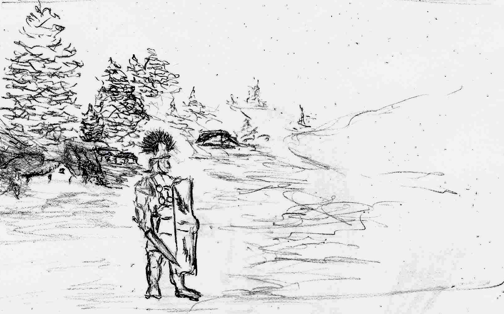

# Fires In the Crypt - Solo Play Options

_by Eduardo del Corral, bajainnotech@proton.me_

This document is a quick supplement for _Sanglorian_'s excellent first level adventure for his 4th Edition Retroclone **Orcus RPG**. All this does is try to provide some solo play options for the start where it's a bit more open ended. I hope you enjoy it.

This is a mod to one of Sanglorian's excellent adventures for Solo/COOP play. To get started, you will the following Orcus RPG material:

* Sanglorian's Orcus Handbook
* The actual Fires In The Crypt adventure.
* A set of level 1 characters

Which [you can get at his GitHub website](https://sanglorian.github.io/orcus/).

And additionally, this mod:

* [Click here to view on your browser as HTML](https://bajainnotech.github.io/fires-in-the-crypt-solo-play-options/Fires%20in%20the%20Crypt%20-%20Solo%20Play%20Options.html), or
* [Click here to view as a PDF](https://bajainnotech.github.io/fires-in-the-crypt-solo-play-options/Fires%20in%20the%20Crypt%20-%20Solo%20Play%20Options.pdf).

You can also [check this out at Itch.io instead](https://bitmysteries.itch.io/fires-in-the-crypt-solo-play-options) if you prefer.

This work is licensed under the OpenGameLicense. It references the Orcus RPG Handbook, which was created and is maintained by Sanglorian and licensed under the OpenGameLicense. It also references Sanglorian's Pre-Gens (five first-level characters) and First Level adventure - Fires in the Crypt.
